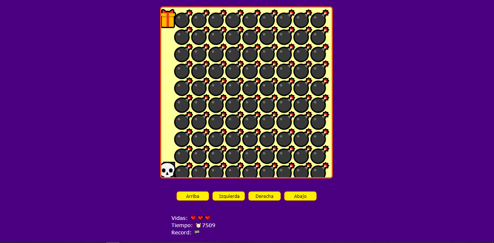

# JavaScript Videogame

## Welcome! 👋

This is a game made with JavaScript where you can use the arrow keys to move the skull.

## Links!

  - Solution URL: https://mauricioc12.github.io/JavaScript-Videogame/
  
## My process

Learn how to use Canvas in Javascript

## Built with: 

- JavaScript Canvas
- Semantic HTML5 markup
- CSS custom properties
